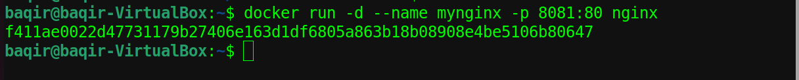
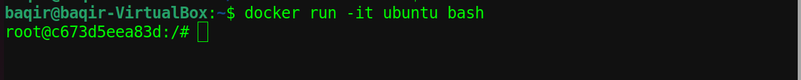
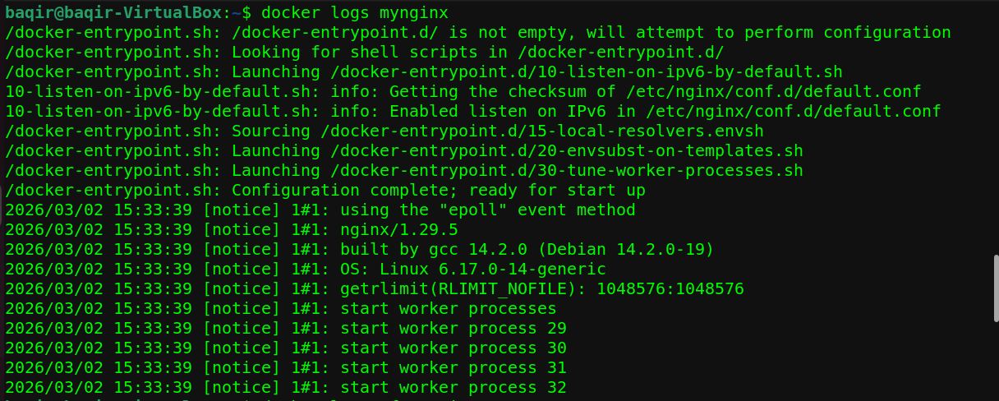

## 📦 Day 02 – Container Lifecycle & Deep Management
## 🚀 Overview

Day 02 focused on understanding how containers behave internally and how to manage them like a DevOps engineer.

This included:

- Container lifecycle states

- Detached vs Interactive mode

- docker logs

- docker exec

- Restart policies

- Real-world debugging concepts

## 📁 Folder Structure

Day-02-Container-Management/
│
├── README.md

└── screenshots/

    ├── docker-ps.png

    ├── detached-nginx.png

    ├── interactive-ubuntu.png

    ├── docker-logs.png

    ├── docker-exec.png

    └── restart-policy.png


## 🧠 Container Lifecycle

A Docker container moves through different states:

```
Created → Running → Stopped → Removed
```
Check running containers:
```
docker ps
```
Check all containers:
```
docker ps -a
```
## 📸 Screenshot:


## 🔹 Detached vs Interactive Mode
# 1️⃣ Detached Mode (-d)

Runs container in background.
```
docker run -d --name mynginx -p 8081:80 nginx
```
- Returns container ID

- Runs in background

## 📸 Screenshot:


# 2️⃣ Interactive Mode (-it)

Runs container in foreground with terminal access.
```
docker run -it ubuntu bash
```
- Creates new container

- Attaches terminal

- Stops when you exit

## 📸 Screenshot:


## 🔍 docker logs

Used to check container output.
```
docker logs mynginx
```
Follow logs in real time:
```
docker logs -f mynginx
```
## 📸 Screenshot:


## 🛠 docker exec (Very Important)

Used to enter an already running container.
```
docker exec -it mynginx sh
```
Key difference:

## Key Difference: docker run vs docker exec

| Feature | docker run -it | docker exec -it |
|----------|----------------|-----------------|
| Container | Creates new container | Uses existing container |
| State | Starts container | Container must be running |
| Purpose | Used for testing | Used for debugging |

## 📸 Screenshot:


## 🔁 Restart Policies

Restart policies control container behavior after exit.

Example:
```
docker run -d --restart always ubuntu sleep 5
```
Behavior:

- sleep runs for 5 seconds

- container stops

- Docker restarts it automatically

- Loop continues

Available options:
| Policy | Description |
|--------|------------|
| no | Default, no restart |
| on-failure | Restart if exit code ≠ 0 |
| unless-stopped | Restart unless manually stopped |
| always | Always restart |

## 📸 Screenshot:


## 🧠 Key Learnings

✔ A container runs as long as its main process runs

✔ Exiting main process stops container

✔ docker exec works only on running containers

✔ Restart policies can create restart loops

✔ Containers are process-based, not full VMs

## 🎯 Outcome

By the end of Day 02, I can:

- Manage container lifecycle

- Enter running containers safely

- Debug using logs

- Understand restart behavior

- Think in terms of container main processes
