## 📦 Day 03 – Docker Images & Dockerfile

## 🎯 Objective

In this lab, I learned how to:

- Build custom Docker images

- Optimize image size

- Compare Ubuntu vs Alpine

- Use multi-stage builds

- Debug Docker build errors

- Run and test containers in browser

## 🏗️ 1️⃣ Basic Dockerfile (Ubuntu + Nginx)

Created a simple Dockerfile using Ubuntu as base image.
```
FROM ubuntu
RUN apt update && apt install -y nginx
CMD ["nginx", "-g", "daemon off;"]
```
## 📸 Screenshot:

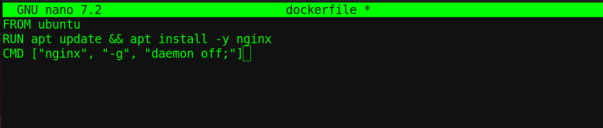

## 🐳 2️⃣ Build Image (v1)
```
docker build -t mynginx:v1 .
docker images
```
## 📸 Screenshots:

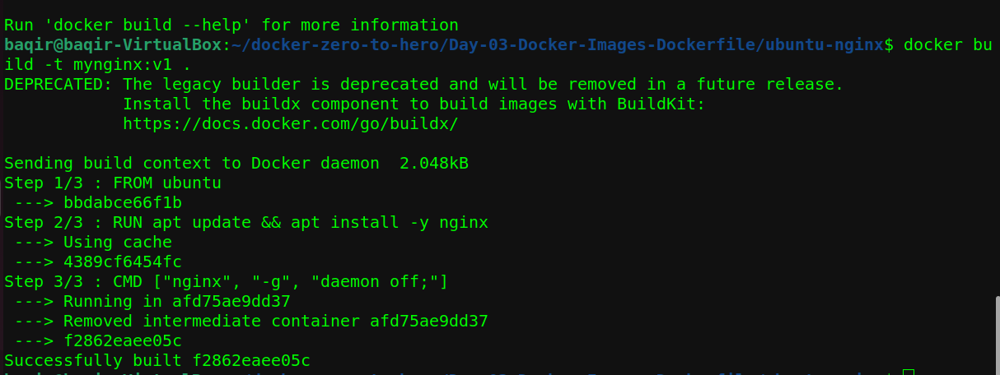
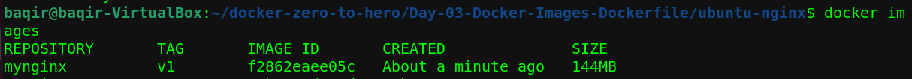

Result:

Image size was large (~144MB)

## 📊 3️⃣ Image Layer Analysis

Used:
```
docker history mynginx:v1
```
## 📸 Screenshot:

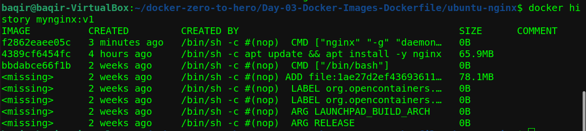

Learned:

- Each RUN instruction creates a layer

- Image size increases with unnecessary cache files

## ⚡4️⃣ Optimized Dockerfile (v2)

Improved Dockerfile by cleaning apt cache:
```
FROM ubuntu
RUN apt update && \
    apt install -y nginx && \
    apt clean && \
    rm -rf /var/lib/apt/lists/*
CMD ["nginx", "-g", "daemon off;"]
```
📸 Screenshots:

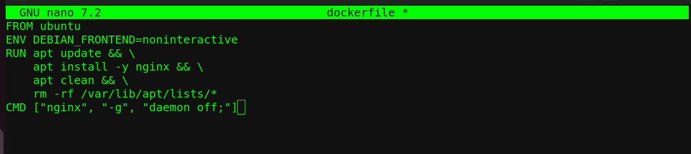
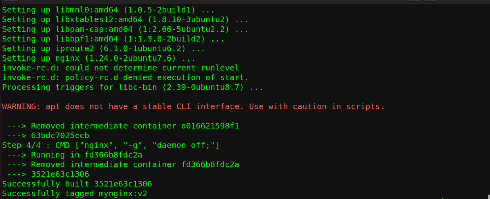

Result:

- Reduced size from 144MB → 84MB

- Saved ~60MB

## 🆚 5️⃣ Ubuntu vs Alpine Comparison

Learned:


| Feature            | Ubuntu              | Alpine                |
|--------------------|--------------------|------------------------|
| Size               | Larger              | Lightweight            |
| Debugging          | Easier              | Smaller production image |
| C Library          | Uses glibc          | Uses musl libc         |

## 📸 Screenshot:

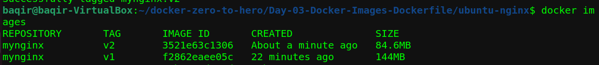
## 🚀 6️⃣ Multi-Stage Build (Production Style)

Created multi-stage Dockerfile:
```
FROM alpine AS builder
WORKDIR /app
COPY index.html .

FROM nginx:alpine
COPY --from=builder /app/index.html /usr/share/nginx/html/index.html

EXPOSE 80
CMD ["nginx", "-g", "daemon off;"]
```
## 📸 Screenshot:

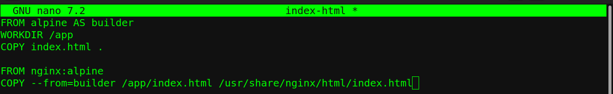

## 🔨 7️⃣ Build Multi-Stage Image
```
docker build -t baqir-site:v1 .
```
## 📸 Screenshot:

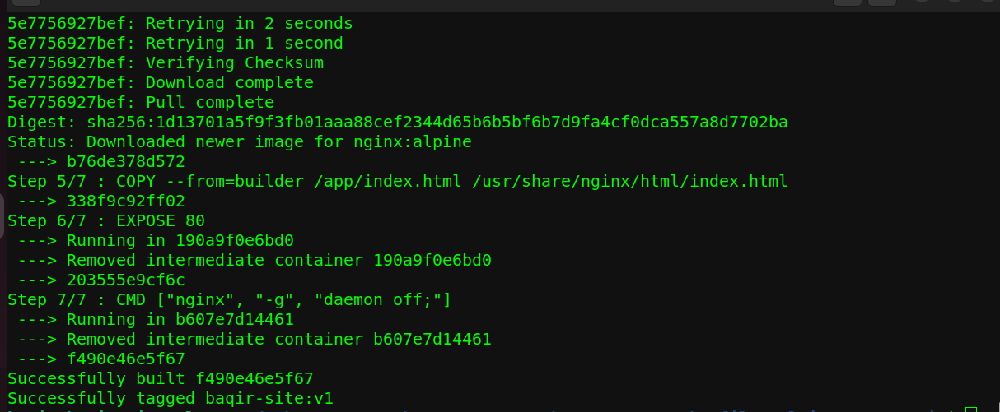

## 🌐 8️⃣ Run Container
```
docker run -d -p 8080:80 baqir-site:v1
```
## 📸 Screenshot:

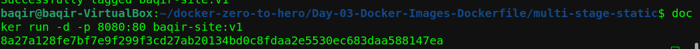
## 🌍 9️⃣ Browser Output

Opened:
```
http://localhost:8080
```
Successfully served custom HTML page.

## 📸 Screenshot:

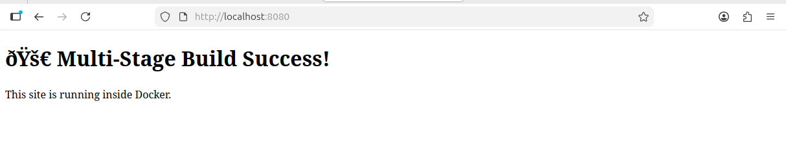
## 🧠 Key Learnings

- Dockerfile instructions create layers

- Always clean package cache to reduce size

- Alpine is lightweight and production-friendly

- Multi-stage builds reduce final image size

- Docker build context matters

- Debugging COPY and container conflicts

- Port mapping (-p 8080:80)

## 📈 Image Size Progress

| Version        | Size                         |
|---------------|------------------------------|
| v1 (Basic)     | 144MB                        |
| v2 (Optimized) | 84MB                         |
| Multi-stage    | Minimal & production ready   |

## 🏁 Conclusion

Day 03 focused on:

- Image creation

- Optimization

- Multi-stage builds

- Real-world troubleshooting

This day built a strong foundation for advanced Docker concepts like Volumes and Networking.
