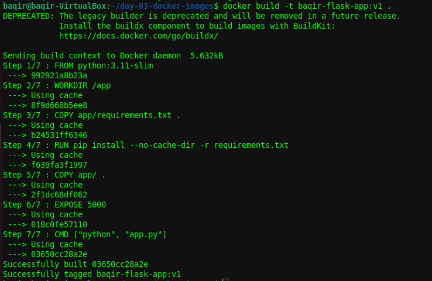
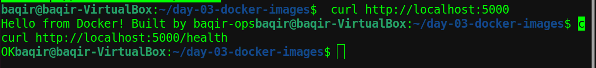
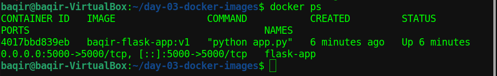
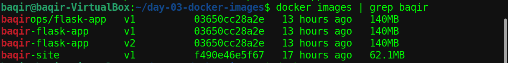
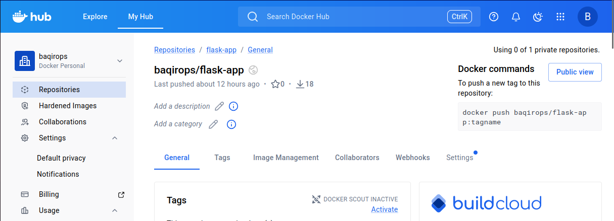

# 📦 Day 03 – Docker Images & Dockerfile Management

## 🎯 Objective

In this lab, I learned how to:

- Write a Python Flask web application
- Create a Dockerfile from scratch
- Build a custom Docker image
- Run and test a containerized app
- Tag images with versions
- Push images to Docker Hub

---

## 📁 Project Structure

```
Day-03-Docker-Images-Dockerfile/
├── app/
│   ├── app.py                  # Flask web application
│   └── requirements.txt        # Python dependencies
├── screenshots/                # All step screenshots
├── Dockerfile                  # Image build instructions
├── .dockerignore               # Files excluded from image
└── README.md
```

---

## 🐍 The Application

A simple Flask web app with two endpoints:

| Endpoint | Response |
|---|---|
| `/` | Hello from Docker! Built by baqir-ops |
| `/health` | OK — used in real DevOps health checks |

**app/app.py**
```python
from flask import Flask
app = Flask(__name__)

@app.route("/")
def home():
    return "Hello from Docker! Built by baqir-ops"

@app.route("/health")
def health():
    return "OK", 200

if __name__ == "__main__":
    app.run(host="0.0.0.0", port=5000)
```

---

## 🐳 Dockerfile

```dockerfile
# Base image - slim = smaller size
FROM python:3.11-slim

# Set working directory inside container
WORKDIR /app

# Copy requirements first (layer caching trick)
COPY app/requirements.txt .

# Install dependencies
RUN pip install --no-cache-dir -r requirements.txt

# Copy app code
COPY app/ .

# Expose port
EXPOSE 5000

# Run the app
CMD ["python", "app.py"]
```

### 💡 Why this order matters
Copying `requirements.txt` **before** the app code is a caching trick.
Docker only re-runs `pip install` if requirements change — making rebuilds much faster.

---

## ⚙️ Step 1 — Build the Image

```bash
docker build -t baqir-flask-app:v1 .
```

Docker reads the Dockerfile top to bottom and builds each layer one by one.



---

## 🚀 Step 2 — Run & Test the App

```bash
docker run -d -p 5000:5000 --name flask-app baqir-flask-app:v1
curl http://localhost:5000
curl http://localhost:5000/health
```

| Flag | Meaning |
|---|---|
| `-d` | Run in background (detached) |
| `-p 5000:5000` | Map host port to container port |
| `--name flask-app` | Give container a name |



---

## 📋 Step 3 — Check Running Container

```bash
docker ps
```

Shows the container is running, which port it uses, and how long it has been up.



---

## 🖼️ Step 4 — View All Images

```bash
docker images | grep baqir
```

Shows all images including v1, v2 and the Docker Hub tagged version.
Same image ID for v1 and v2 — Docker is smart, no duplication!



---

## 🌍 Step 5 — Docker Hub

```bash
docker tag baqir-flask-app:v1 baqirops/flask-app:v1
docker push baqirops/flask-app:v1
```

Image is now publicly available. Anyone can pull and run it with:

```bash
docker pull baqirops/flask-app:v1
docker run -d -p 5000:5000 baqirops/flask-app:v1
```

🔗 https://hub.docker.com/r/baqirops/flask-app



---

## 💡 Key Learnings

- A **Dockerfile** is a recipe — it tells Docker exactly how to build your image
- **Images** are blueprints. **Containers** are running instances of images
- **Layer caching** makes rebuilds faster — order of instructions matters
- The `/health` endpoint is a real pattern used in production DevOps pipelines
- `docker inspect` shows full image metadata in JSON format
- `docker history` shows every layer and its size
- **Tagging** images (v1, v2) is how versioning works in real CI/CD pipelines
- Pushing to **Docker Hub** makes your image globally available

---

## ✅ Skills Practiced

- Writing a Dockerfile from scratch
- Building and tagging Docker images
- Running containers with port mapping
- Debugging a real build error (`=` vs `==` in requirements.txt)
- Pushing images to Docker Hub
- Understanding Docker layer caching

---

## 🏆 Final Outcome

By the end of Day 03 I was able to:

- ✅ Write a Dockerfile from scratch
- ✅ Build a custom Docker image
- ✅ Run a Flask app inside a container
- ✅ Debug a real error independently
- ✅ Push a working image to Docker Hub
- ✅ Understand image versioning and layer caching

---

*Part of my DevOps learning journey → [github.com/baqir-ops](https://github.com/baqir-ops)*
