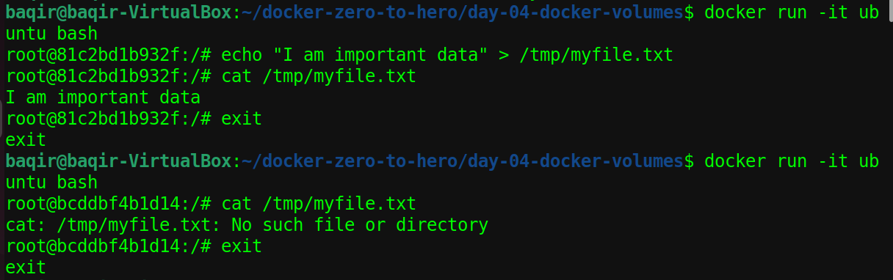
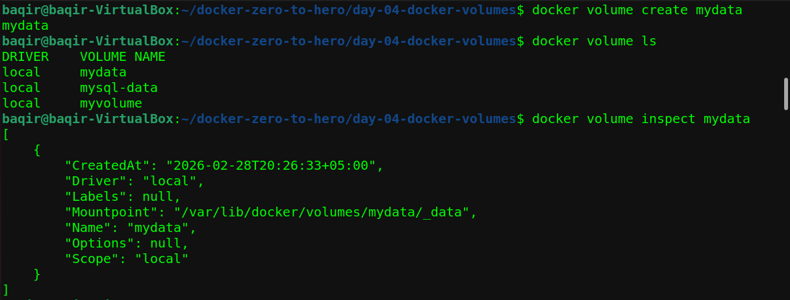
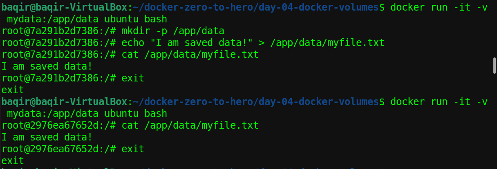
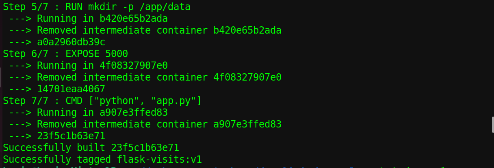
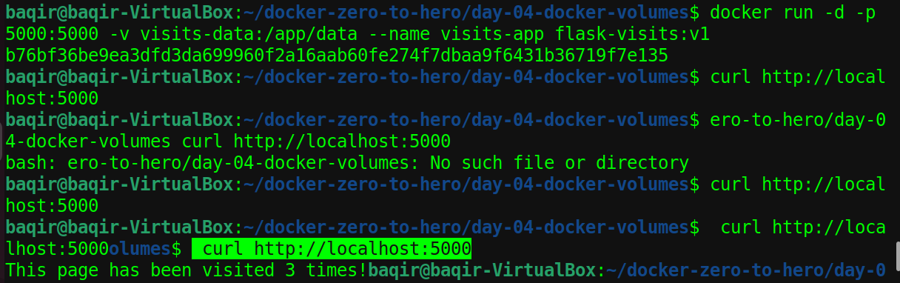
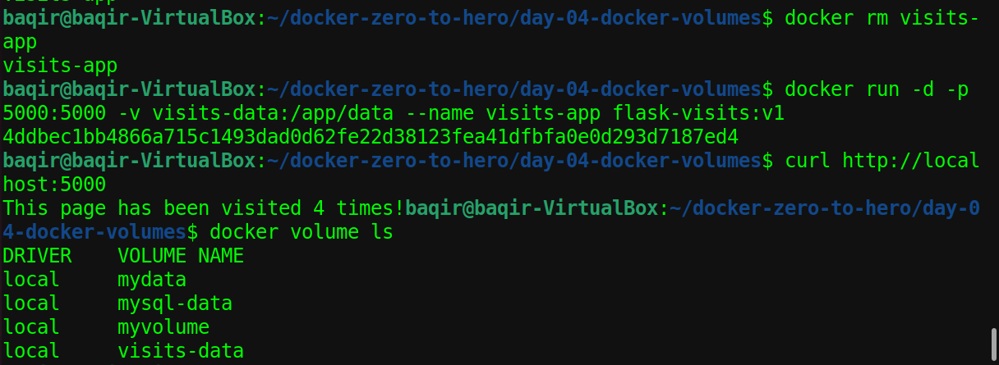
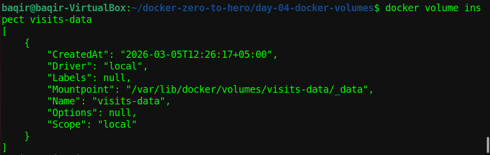
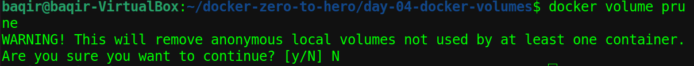

# 📦 Day 04 – Docker Volumes & Data Persistence

## 🎯 Objective

In this lab, I learned how to:

- Understand why containers lose data by default
- Create and manage Docker volumes
- Attach volumes to containers to persist data
- Prove data survives container stop and removal
- Inspect and manage volumes with Docker CLI
- Build a real Flask visit counter app using volumes

---

## 📁 Project Structure

```
Day-04-Docker-Volumes/
├── app.py                  # Flask visit counter app
├── Dockerfile              # Image build instructions
├── screenshots/            # All step screenshots
└── README.md
```

---

## ❌ Step 1 — The Problem: Data is Lost Without Volumes

By default, every container starts fresh. Any data created inside is destroyed when the container stops.

```bash
# Container 1 — create data
docker run -it ubuntu bash
echo "I am important data" > /tmp/myfile.txt
cat /tmp/myfile.txt
exit

# Container 2 — data is GONE
docker run -it ubuntu bash
cat /tmp/myfile.txt
# cat: /tmp/myfile.txt: No such file or directory
exit
```



### 💡 Why This Matters

| Without Volumes | With Volumes |
|---|---|
| Container stops → data gone forever | Data lives outside container |
| Database crashes → all records lost | Data survives restarts |
| Not suitable for production | Production ready |

---

## ✅ Step 2 — Create a Volume & Inspect It

```bash
docker volume create mydata
docker volume ls
docker volume inspect mydata
```

Docker stores volume data at:
```
/var/lib/docker/volumes/mydata/_data
```



---

## 💾 Step 3 — Data Persists With a Volume

```bash
# Container 1 — save data to volume
docker run -it -v mydata:/app/data ubuntu bash
mkdir -p /app/data
echo "I am saved data!" > /app/data/myfile.txt
cat /app/data/myfile.txt
exit

# Container 2 — data is still there!
docker run -it -v mydata:/app/data ubuntu bash
cat /app/data/myfile.txt
# I am saved data!
exit
```

**Data survived across two completely different containers!** ✅



---

## 🐍 The Application — Flask Visit Counter

A Flask app that counts visits and saves the count to a volume. Every time someone visits, the count goes up — and survives container restarts!

**app.py**
```python
from flask import Flask
import os

app = Flask(__name__)
DATA_FILE = "/app/data/visits.txt"

@app.route("/")
def home():
    if not os.path.exists(DATA_FILE):
        count = 0
    else:
        with open(DATA_FILE, "r") as f:
            count = int(f.read())
    count += 1
    with open(DATA_FILE, "w") as f:
        f.write(str(count))
    return f"This page has been visited {count} times!"

@app.route("/health")
def health():
    return "OK", 200

if __name__ == "__main__":
    app.run(host="0.0.0.0", port=5000)
```

**Dockerfile**
```dockerfile
FROM python:3.11-slim
WORKDIR /app
RUN pip install flask
COPY app.py .
RUN mkdir -p /app/data
EXPOSE 5000
CMD ["python", "app.py"]
```

---

## 🔨 Step 4 — Build the Image

```bash
docker build -t flask-visits:v1 .
```



---

## 🚀 Step 5 — Run & Test With Volume

```bash
docker volume create visits-data

docker run -d -p 5000:5000 \
  -v visits-data:/app/data \
  --name visits-app \
  flask-visits:v1

curl http://localhost:5000
curl http://localhost:5000
curl http://localhost:5000
```

Output:
```
This page has been visited 1 times!
This page has been visited 2 times!
This page has been visited 3 times!
```



---

## 🔄 Step 6 — Prove Data Survives Container Restart

```bash
# Stop and remove the container
docker stop visits-app
docker rm visits-app

# Start a brand new container with the same volume
docker run -d -p 5000:5000 \
  -v visits-data:/app/data \
  --name visits-app \
  flask-visits:v1

curl http://localhost:5000
# This page has been visited 4 times! ✅
```

**Count continued from 3 → 4! The volume saved the data!** 🎉



---

## 🔍 Step 7 — Inspect Volume Details

```bash
docker volume ls
docker volume inspect visits-data
```

Shows:
- **Mountpoint** — where Docker stores the data on host
- **CreatedAt** — when the volume was created
- **Driver** — local (default)



---

## 🧹 Step 8 — Volume Management

```bash
# List all volumes
docker volume ls

# Remove a specific volume
docker volume rm mydata

# Remove all unused volumes (be careful!)
docker volume prune
```



> ⚠️ `docker volume prune` will ask for confirmation before deleting. Always type `N` unless you're sure!

---

## 💡 Key Learnings

- Containers are **stateless** by default — all data dies when container stops
- **Docker Volumes** store data outside the container — managed by Docker
- The `-v volumename:/path` flag attaches a volume when running a container
- Same volume can be shared across multiple containers
- `docker volume inspect` shows where data is physically stored on the host
- Volumes are **essential for databases** in production environments
- `docker volume prune` removes unused volumes — use with caution!

---

## ✅ Skills Practiced

- Creating and managing Docker volumes
- Proving data loss without volumes
- Attaching volumes with `-v` flag
- Building a stateful Flask application
- Demonstrating data persistence across container restarts
- Volume inspection and lifecycle management

---

## 🏆 Final Outcome

By the end of Day 04 I was able to:

- ✅ Explain why containers lose data by default
- ✅ Create Docker volumes and attach them to containers
- ✅ Build a Flask visit counter app that persists data
- ✅ Prove data survives container stop, remove and restart
- ✅ Inspect and manage volumes using Docker CLI
- ✅ Understand when to use volumes in real production scenarios

---

*Part of my DevOps learning journey → [github.com/baqir-ops](https://github.com/baqir-ops)*
