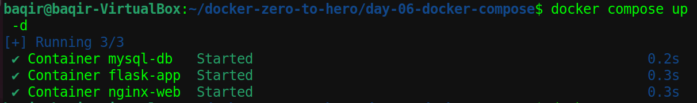
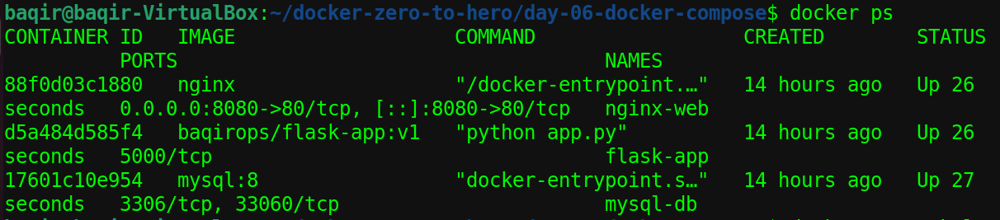
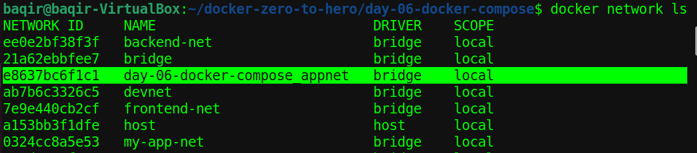
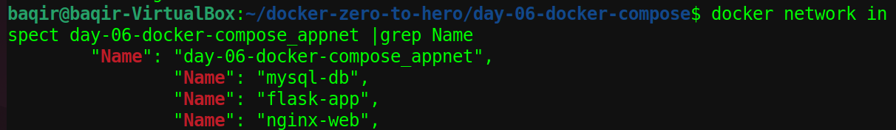
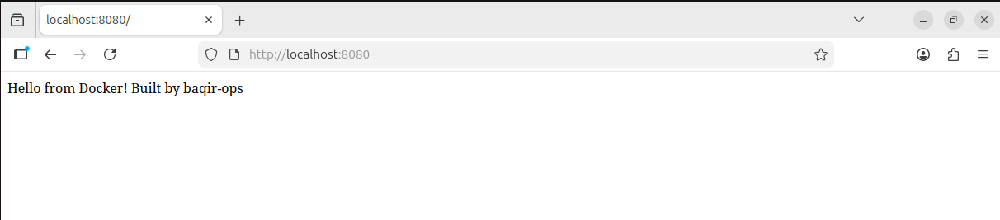

# Docker Compose Multi-Container Application

### Nginx + Flask + MySQL

## Project Overview

This project demonstrates how to deploy a **multi-container application** using **Docker Compose**.

The stack includes:

* **Nginx** – Reverse proxy web server
* **Flask** – Backend application
* **MySQL** – Database
* **Docker Network** – Container communication

Docker Compose automatically creates a network and connects all services.

---

# Architecture

```
Browser
   │
   ▼
localhost:8080
   │
   ▼
Nginx Reverse Proxy
   │
   ▼
Flask Application
   │
   ▼
MySQL Database
```

---

# Project Structure

```
day-06-docker-compose
│
├── docker-compose.yml
├── nginx
│   └── default.conf
├── screenshots
│   ├── docker-compose-start.png
│   ├── running-containers.png
│   ├── docker-network.png
│   ├── network-inspect.png
│   └── app-running-browser.png
│
└── README.md
```

---

# Technologies Used

* Docker
* Docker Compose
* Nginx
* Flask
* MySQL
* Linux

---

# Services

## Nginx

Acts as a **reverse proxy** that forwards incoming requests to the Flask application.

Port mapping:

```
8080 → 80
```

---

## Flask Application

The backend application running inside a container.

Example response:

```
Hello from Docker! Built by baqir-ops
```

---

## MySQL Database

Database service running in a container.

Environment variable used:

```
MYSQL_ROOT_PASSWORD=root
```

---

# Running the Project

Start containers:

```
docker compose up -d
```

Check running containers:

```
docker ps
```

Stop containers:

```
docker compose down
```

---

# Docker Network

Docker Compose automatically creates a network:

```
day-06-docker-compose_appnet
```

Verify network:

```
docker network inspect day-06-docker-compose_appnet
```

Containers communicate using service names:

```
flask-app
mysql-db
nginx-web
```

---

# Screenshots

## Docker Compose Start



## Running Containers



## Docker Network



## Network Inspect



## Application Running in Browser



---

# DevOps Concepts Practiced

* Containerization
* Multi-container orchestration
* Reverse proxy configuration
* Docker networking
* Infrastructure as Code

---

# Author

**Muhammad Baqir Nawaz**

DevOps & Cloud Engineering Learning Journey

